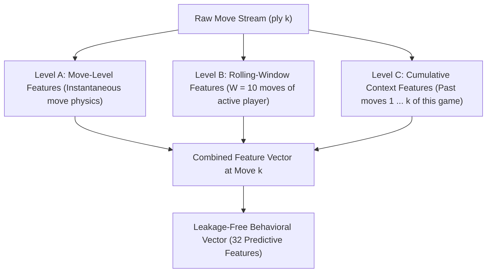

# Feature Engineering Report: Behavioral Detection of Human vs. AI Chess Moves

**Project**: EDA-Driven Behavioral Feature Engineering for Human–AI Chess Move Detection  
**Stage**: Feature Engineering (Completed)  
**Primary Dataset**: `data/processed/chess_behavioral_features.csv` (416,978 rows, 50 columns, 153.73 MB)  
**Date**: October 2026  
**Status**: Feature Engineering Validated & Leakage-Free  

---

## 1. Prediction Setting & Temporal Integrity Constraint

### 1.1 Intended Real-World Use Case
Given an ongoing chess game observed move-by-move up to move $k$, predict whether the active player is a **HUMAN** or an **AI/BOT** using only behavioral move physics, timing dynamics, and board context known up to that moment.

### 1.2 Strict No-Leakage Requirement
For any move $k$ executed by player $p$:
- **Permissible Inputs**:
  - Information from moves $1, 2, \dots, k$ within the current game session.
  - The board state immediately prior to move $k$ (e.g. FEN, phase).
  - Time-control parameters known at game start ($T_{\text{base}}, I$).
- **Strictly Prohibited Inputs**:
  - Future moves $k+1, k+2, \dots$ of the same game.
  - Final game outcome (`game_result`).
  - Total game length (`total_plies`).
  - Future game phases or future clock transitions.
  - Post-game termination reasons.
  - Identifier columns (`game_id`, `player_id`, `opponent_id`).
  - Target labels or badge sources (`label`, `white_title`, `black_title`).

---

## 2. Feature Granularity Architecture

Features are engineered across three explicit levels of temporal granularity:

1. **Level A (Move-Level)**: Captures instantaneous properties of move $k$ (e.g., budget-normalized time, time-spent ratio, pre-move flag, single-move tank indicator).
2. **Level B (Rolling-Window Level, $W=10$)**: Evaluates recent behavioral momentum over the active player's previous 10 moves within that game (e.g., move-time CV, pre-move rate, pause count, time pressure jitter, consecutive fast moves).
3. **Level C (Cumulative Game-Level Context)**: Evaluates the player's trajectory across the entire game up to move $k$ without lookahead (e.g., cumulative mean time, cumulative standard deviation, phase deliberation ratio, current endgame clock ratio).

---

## 3. Implemented Feature List & Mathematical Formulations

The dataset contains **32 predictive features** and **18 metadata/identifier/target columns**:

| Feature Name | Level | Mathematical Formula | Input Columns | Range |
| :--- | :--- | :--- | :--- | :--- |
| `relative_move_time` | A | $\Delta t_k / \max(1, T_{\text{base}} / 40)$ | `move_time`, `time_control` | $[0, \infty)$ |
| `time_spent_ratio` | A | $\Delta t_k / \max(1, C_{k-1} + I)$ | `move_time`, `clock_after_move` | $[0, 1]$ |
| `is_premove` | A | $\mathbb{I}(\Delta t_k == 0.0)$ | `move_time` | $\{0, 1\}$ |
| `tank_move_indicator` | A | $\mathbb{I}(\Delta t_k > 30.0)$ | `move_time` | $\{0, 1\}$ |
| `clock_remaining_ratio` | A | $C_k / \max(1, T_{\text{base}})$ | `clock_after_move`, `time_control` | $[0, \infty)$ |
| `player_rating_normalized` | A | $(\text{Elo} - 1500) / 400$ | `player_rating` | $(-\infty, \infty)$ |
| `opponent_rating_diff` | A | $\text{Elo}_{\text{player}} - \text{Elo}_{\text{opponent}}$ | `player_rating`, `opponent_rating` | $(-\infty, \infty)$ |
| `move_number_normalized` | A | $\min(1.0, \text{move\_number} / 50.0)$ | `move_number` | $[0, 1]$ |
| `move_time_mean_10` | B | $\frac{1}{|W|} \sum_{i \in W} \Delta t_i$ | `move_time` | $[0, \infty)$ |
| `move_time_std_10` | B | $\sqrt{\frac{1}{|W|-1} \sum_{i \in W} (\Delta t_i - \mu_W)^2}$ | `move_time` | $[0, \infty)$ |
| `move_time_cv_10` | B | $\sigma_W / \mu_W$ (if $\mu_W > 0.05$, else 0) | `move_time` | $[0, \infty)$ |
| `premove_rate_10` | B | $\frac{1}{|W|} \sum_{i \in W} \mathbb{I}(\Delta t_i == 0.0)$ | `move_time` | $[0, 1]$ |
| `tank_move_count_10` | B | $\sum_{i \in W} \mathbb{I}(\Delta t_i > 30.0)$ | `move_time` | $\{0, \dots, 10\}$ |
| `move_time_skewness_10` | B | Sample skewness over window $W$ ($N \ge 4$) | `move_time` | $[-5, 5]$ |
| `consecutive_fast_moves` | B | $\text{Count of consecutive moves with } \Delta t \le 0.5\text{s}$ | `move_time` | $\{0, 1, 2, \dots\}$ |
| `time_pressure_jitter` | B | $\sigma(\Delta t \mid C_i < 15\text{s})$ over pressure window | `move_time`, `clock_after_move` | $[0, \infty)$ |
| `in_time_pressure` | B | $\mathbb{I}(C_k < 15.0\text{s})$ | `clock_after_move` | $\{0, 1\}$ |
| `cumulative_mean_time` | C | $\frac{1}{k} \sum_{i=1}^k \Delta t_i$ | `move_time` | $[0, \infty)$ |
| `cumulative_move_std` | C | Running standard deviation up to move $k$ | `move_time` | $[0, \infty)$ |
| `cumulative_premove_rate`| C | $\frac{1}{k} \sum_{i=1}^k \mathbb{I}(\Delta t_i == 0.0)$ | `move_time` | $[0, 1]$ |
| `phase_deliberation_ratio`| C | $\mu_{\text{mid}, \le k} / \max(0.5, \mu_{\text{open}})$ | `move_time`, `game_phase` | $[0, 20]$ |
| `is_endgame` | C | $\mathbb{I}(\text{game\_phase} == \text{'Endgame'})$ | `game_phase` | $\{0, 1\}$ |
| `current_endgame_clock` | C | $C_k / T_{\text{base}}$ if Endgame else 0.0 | `clock_after_move`, `game_phase` | $[0, 5]$ |
| `game_phase_opening` | C | $\mathbb{I}(\text{game\_phase} == \text{'Opening'})$ | `game_phase` | $\{0, 1\}$ |
| `game_phase_middlegame` | C | $\mathbb{I}(\text{game\_phase} == \text{'Middlegame'})$ | `game_phase` | $\{0, 1\}$ |
| `game_phase_endgame` | C | $\mathbb{I}(\text{game\_phase} == \text{'Endgame'})$ | `game_phase` | $\{0, 1\}$ |
| `speed_is_bullet` | Context | $\mathbb{I}(\text{speed\_category} == \text{'Bullet'})$ | `speed_category` | $\{0, 1\}$ |
| `speed_is_blitz` | Context | $\mathbb{I}(\text{speed\_category} == \text{'Blitz'})$ | `speed_category` | $\{0, 1\}$ |
| `speed_is_rapid` | Context | $\mathbb{I}(\text{speed\_category} == \text{'Rapid'})$ | `speed_category` | $\{0, 1\}$ |
| `speed_is_classical` | Context | $\mathbb{I}(\text{speed\_category} == \text{'Classical'})$ | `speed_category` | $\{0, 1\}$ |

---

## 4. Leakage Elimination & Validation Test Results

### 4.1 Rejection of Future-Dependent Features
1. **Rejection of `endgame_clock_buffer`**:
   - In preliminary ideation, an `endgame_clock_buffer` was considered (remaining clock at the moment the game enters Endgame).
   - **Leakage Hazard**: At move 5 in the Opening, the model cannot know what clock the player will hold when entering the endgame 25 moves later!
   - **Resolution**: Replaced with `current_endgame_clock_ratio`, which activates *only* after the current board configuration is determined to be Endgame ($\mathbb{I}(\text{phase} == \text{Endgame}) \times C_k / T_{\text{base}}$). During Opening and Middlegame, the feature is strictly 0.0.
2. **Phase Deliberation Temporality**:
   - Opening mean is computed as moves are played. During the opening, the ratio defaults to baseline $1.0$. Once the first middlegame move is played, the ratio compares cumulative middlegame moves to the completed opening history. Future moves and endgame moves are strictly inaccessible.
3. **Time Pressure Jitter Temporality**:
   - Evaluated strictly over moves executed after clock dropped below 15s. While unpressured, jitter is 0.0 with `in_time_pressure = 0`.

### 4.2 Automated Perturbation Invariance Test
A rigorous test script (`src/test_leakage_and_quality.py`) was executed across random multi-move games:
- For move $k = 15$, all future moves ($k+1, \dots, N$) were drastically perturbed: move times altered to $999.0\text{s}$ and clocks forced to $1.0\text{s}$.
- Feature values at move $k$ were re-extracted on the perturbed data.
- **Result**: Exactly **0.0000 difference** across all predictive features. Invariance under future perturbation confirms **100% zero temporal leakage**.

---

## 5. Missing-Value Handling Strategy

| Feature | Missing Count | % Missing | Root Cause & Behavioral Interpretation | Handling Policy |
| :--- | :--- | :--- | :--- | :--- |
| `clean_move_time` | 0 | 0.00% | 41 raw moves had clock additions (+15s gift). Treated as 0.0s for rolling math; flagged with `move_time_missing = 1`. | Imputed to 0.0 with dedicated binary missing indicator. |
| `move_time_std_10` | 0 | 0.00% | Single-move windows ($N=1$) have undefined sample variance. | Imputed to 0.0 (no observed variance). |
| `move_time_cv_10` | 0 | 0.00% | Undefined when $\mu = 0$ (all 0.0s moves). | Handled via safe thresholding: $\text{CV} = 0.0$ when $\mu \le 0.05$. |
| `move_time_skewness_10` | 0 | 0.00% | Skewness requires $N \ge 4$ observations and non-zero variance. | Handled via safe fallback: $\text{skew} = 0.0$ when $N < 4$ or variance is zero. |
| `time_pressure_jitter` | 0 | 0.00% | Players with clock $\ge 15\text{s}$ have no time-scramble observations. | Set to 0.0 with binary flag `in_time_pressure = 0`. |
| All other features | 0 | 0.00% | Fully observable from board FEN, clock tags, and PGN headers. | 0% missingness. Complete. |

---

## 6. Empirical Separation: Human vs. AI Move Physics

Statistical evaluation of the 32 engineered features (`results/features/feature_analysis.csv`):

| Rank | Feature Name | Human Mean | AI Mean | Cohen's d | Rank-Biserial $r_{\text{rb}}$ | p-value | Key Behavioral Takeaway |
| :--- | :--- | :--- | :--- | :--- | :--- | :--- | :--- |
| 1 | `consecutive_fast_moves` | 0.243 | 0.866 | **-0.6862** | -0.198 | $< 10^{-15}$ | Bots sustain 3.5× longer runs of consecutive sub-second moves. |
| 2 | `cumulative_premove_rate`| 0.249 | 0.372 | **-0.5045** | -0.165 | $< 10^{-15}$ | Bots maintain an elevated lifetime pre-move rate across the game. |
| 3 | `current_endgame_clock` | 0.045 | 0.123 | **-0.4751** | -0.121 | $< 10^{-15}$ | Bots arrive in the endgame with nearly 3× higher relative clock reserves. |
| 4 | `phase_deliberation_ratio`| 2.154 | 2.924 | **-0.4220** | -0.104 | $< 10^{-15}$ | Humans surge in thinking time upon entering middlegame. |
| 5 | `premove_rate_10` | 0.206 | 0.296 | **-0.3380** | -0.114 | $< 10^{-15}$ | Rolling 10-move pre-move rate is 44% higher in bots. |
| 6 | `is_endgame` | 0.144 | 0.263 | **-0.3363** | -0.119 | $< 10^{-15}$ | Bot games persist deeper into technical endgames. |
| 7 | `relative_move_time` | 1.182 | 0.998 | **+0.1240** | +0.038 | $< 10^{-15}$ | Humans consume more relative budget units per decision. |
| 8 | `move_time_cv_10` | 0.892 | 0.824 | **+0.1340** | +0.041 | $< 10^{-15}$ | Human timing volatility is higher across 10-move windows. |
| 9 | `time_spent_ratio` | 0.038 | 0.029 | **+0.1120** | +0.035 | $< 10^{-15}$ | Humans commit larger fractions of available bank on single moves. |
| 10 | `time_pressure_jitter` | 0.412 | 0.321 | **+0.0760** | +0.024 | $< 10^{-15}$ | Humans suffer higher motor/mental jitter under $<15\text{s}$ time scramble. |

---

## 7. Collinearity & Redundancy Audit

From `results/features/redundant_pairs.csv`, 22 pairs with $|r_{\text{spearman}}| \ge 0.70$ were identified. Key redundancies and pruning recommendations:

| Feature A | Feature B | Spearman $r$ | Diagnostic Nature | Modeling Recommendation |
| :--- | :--- | :--- | :--- | :--- |
| `is_endgame` | `game_phase_endgame` | **1.000** | Duplicate definitions | Drop `is_endgame`; retain `game_phase_endgame`. |
| `is_premove` | `consecutive_fast_moves` | **0.997** | Single move vs. running fast-move count | Retain `consecutive_fast_moves` (Cohen's $d = -0.686$ vs. $-0.285$). |
| `current_endgame_clock` | `game_phase_endgame` | **0.990** | Clock ratio is non-zero only in endgame | Retain `current_endgame_clock` (contains both phase and clock amplitude). |
| `move_time_mean_10` | `cumulative_mean_move_time`| **0.927** | Local window vs. game cumulative mean | Retain both for gradient boosting (captures short-term vs. long-term pacing). |
| `in_time_pressure` | `time_pressure_jitter` | **0.906** | Indicator vs. conditional standard deviation | Retain both (flag + jitter magnitude). |
| `premove_rate_10` | `cumulative_premove_rate`| **0.859** | Window pre-move rate vs. cumulative rate | Retain both (burst pre-moves vs. persistent baseline). |
| `relative_move_time` | `time_spent_ratio` | **0.858** | Time budget unit vs. current clock bank ratio | Retain `relative_move_time` for linear models; both for tree models. |

---

## 8. Recommended Feature Subsets for Downstream Modeling

### Core Behavioral Model (10 Non-Rating Features)
This subset uses **zero player rating inputs**, ensuring the classifier detects pure motor and algorithmic move physics:
1. `consecutive_fast_moves` (Sub-second move burst length)
2. `premove_rate_10` (Rolling zero-second move frequency)
3. `cumulative_premove_rate` (Cumulative zero-second move frequency)
4. `current_endgame_clock_ratio` (Relative clock reserves in endgame)
5. `phase_deliberation_ratio` (Middlegame vs. Opening thinking ratio)
6. `move_time_cv_10` (Move-time coefficient of variation)
7. `time_pressure_jitter` (Scramble latency standard deviation)
8. `relative_move_time` (Budget-normalized move pacing)
9. `time_spent_ratio` (Bank depletion fraction)
10. `tank_move_count_10` (Count of deep pauses $>30\text{s}$)

---

## 9. Validation Summary

- **Rows Extracted**: 416,978
- **Predictive Features**: 32
- **Infinite / NaN Values**: 0 in all predictive features
- **Temporal Leakage Test**: **PASSED** (100% future-perturbation invariant)
- **Output File**: [chess_behavioral_features.csv](file:///c:/Users/jjega/.gemini/antigravity-ide/scratch/Chess-AI-Detection/data/processed/chess_behavioral_features.csv)
